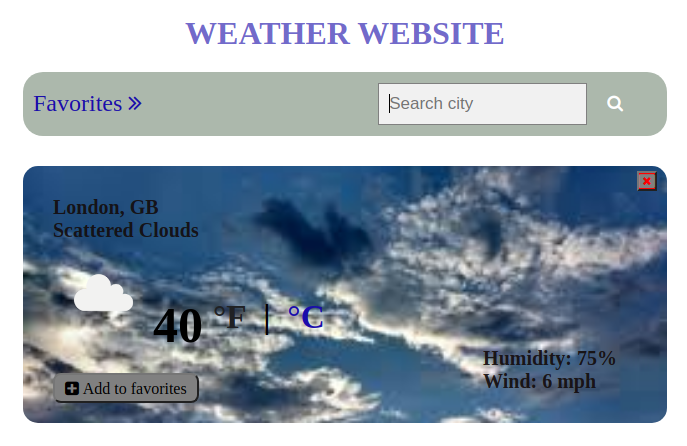

# PROJECT: WEATHER APP

### What I built

> A weather app where users can search and retrieve weather information of any given city around the world.


### Project screenshot




### 📝 Setup

 - Open a terminal
 
 - Clone this app: 
        ```
        git clone https://github.com/ezeilo-su/js-weather-app
        ```

- Run the command ```npm install``` from root directory to install the app dependencies.

- Run the command ```npx webpack``` to bundle up the files.

- Run the command ```npm run dev``` to start a dev server.


### Build With

-	HTML
- JavaScript
- Webpack
- SCSS    


## 👤 Author

👤 **Sunday Uche Ezeilo**

- Github: [@sundayezeilo](https://github.com/ezeilo-su)
- Twitter: [@SundayEzeilo](https://twitter.com/SundayEzeilo)
- Linkedin: [Sunday Ezeilo](https://www.linkedin.com/in/sunday-ezeilo-a6a67664/)

## 🤝 Contributing

Contributions, issues and feature requests are welcome!

Feel free to check the [issues page](https://github.com/ezeilo-su/js-weather-app/issues).

## Show your support

Give a ⭐️ if you like this project!

## Acknowledgments

- Microverse
- @ebukaume
- etc
